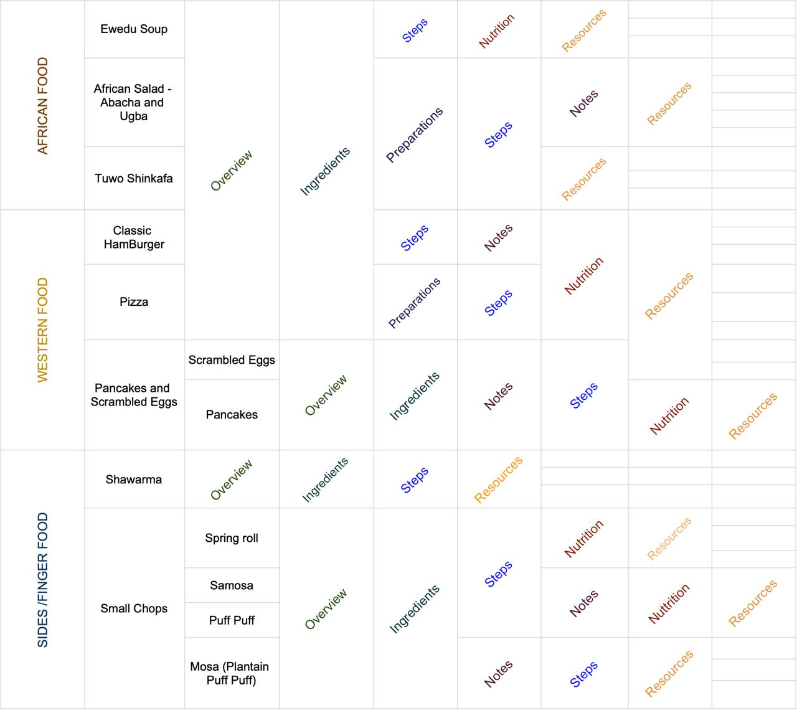

# CIPPE
Cippe is a Recipe API to create recipies of delicious dishes.

The list and data of food involved are:

## DATABASE
We used SQLite3 to store the data received and [@peewee](https://github.com/coleifer/peewee) ORM to query and store data. 
The table names are Food, Ingredients and Steps, represented below:

